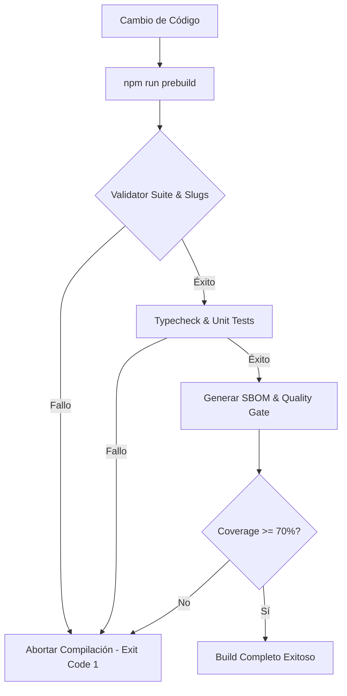

# Informe de Arquitectura de Seguridad y DevSecOps — RAIA

Este informe resume los controles de seguridad, directrices de automatización DevSecOps y las salvaguardas de ciclo de vida de desarrollo seguro aplicados al portal RAIA.

---

## 1. Ciclo de Vida Seguro y DevSecOps (Secure SDLC)

RAIA adopta un enfoque de **Fail-Closed (Fallo Cerrado)** en todas sus etapas de compilación, validación y despliegue.

### 1.1 Suite de Validación Unificada (`validateAll.ts`)
* Todo el conjunto de datos de la arquitectura (Áreas de Negocio, Dominios de Servicio, Flujos de Secuencia, etc.) se somete a validación de integridad referencial.
* Se ejecuta de forma síncrona en el paso `prebuild`.
* Incorpora validación de unicidad de slugs. Cualquier colisión aborta la compilación inmediatamente.

### 1.2 Quality Gate de Pruebas Unitarias (`calculateQualityGate.ts`)
* Valida la existencia e integridad del reporte de cobertura `coverage-summary.json` generado por Vitest.
* Si el archivo no existe, está corrupto o contiene valores de cobertura inferiores al **70%**, lanza un error con código de salida `1` para bloquear el proceso CI/CD.

### 1.3 Registro de Inventario de Componentes (CycloneDX SBOM)
* Generación local y determinista de un archivo de inventario (Software Bill of Materials) en formato CycloneDX: `artifacts/sbom/raia-sbom.cdx.json`.
* Permite auditar en tiempo de compilación la cadena de suministro de dependencias de software.

---

## 2. Reducción de la Superficie de Ataque en Dependencias

* Se eliminaron librerías obsoletas o redundantes del entorno de producción y desarrollo, tales como `elkjs`, `@testing-library/jest-dom` y `@types/jest`.
* El uso de comandos dinámicos como `npx tsx` fue erradicado de los scripts en favor del binario local de `tsx` administrado estrictamente bajo el lockfile del proyecto.

---

## 3. Pruebas de Cumplimiento en Tiempo de Ejecución (E2E)

* Pruebas automatizadas en Playwright verifican periódicamente en el entorno desplegado la presencia de encabezados CSP sin `unsafe-eval` y la ausencia de violaciones de directiva o excepciones en consola de navegación.
