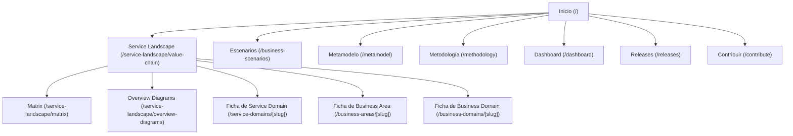

# Arquitectura de Información y Modelo de Navegación

Este documento detalla la estructura y el modelo mental de navegación actual del portal RAIA.

## 🗺️ Mapa del Sitio (Sitemap)

El sitemap actual muestra una organización jerárquica de dos niveles para el portal de inicio y una distribución relacional-lateral para las fichas de detalle arquitectónico:

::: mermaid

:::

*(Puedes encontrar el archivo original del diagrama en [sitemap-current.mmd](./diagrams/sitemap-current.mmd))*

---

## 🧭 Flujo de Navegación del Usuario

1. **Punto de Entrada (`/`)**:
   * El usuario ve un banner inicial con estadísticas generales del repositorio.
   * Se presentan tarjetas organizadas por "Secciones" según la documentación y metamodelo.
   * Se ofrece un buscador destacado en la parte superior y en el centro de la tarjeta de bienvenida.

2. **Navegación en el Landscape (`/service-landscape/value-chain`)**:
   * Vista principal interactiva basada en React Flow.
   * Permite ver la cadena de valor distribuida en columnas y contenedores agrupados por Áreas y Dominios de Negocio.
   * Al hacer clic en un nodo de Service Domain:
     * Se abre un panel lateral contextual (`DetailSidebar.tsx`) que despliega metadatos, objetos de negocio foco, y relaciones de dependencia.
     * Ofrece un enlace directo a la Ficha Técnica Completa (`/service-domains/[slug]`).

3. **Fichas Técnicas (`/service-domains/[slug]`, `/business-areas/[slug]`, `/business-domains/[slug]`)**:
   * Despliegan un resumen conceptual, lista de capacidades, y tablas detalladas de APIs semánticas y trazas regulatorias.
   * La navegación de regreso obliga a usar el enlace "Volver al Service Landscape" o los breadcrumbs del header (si están presentes), perdiendo a veces el zoom o nodo previamente seleccionado en el canvas.

4. **Escenarios de Negocio (`/business-scenarios`)**:
   * Se divide en una columna izquierda para seleccionar el caso de uso y una columna derecha con el detalle.
   * El detalle incluye un Diagrama de Secuencia interactivo (React Flow simplificado), una sección de narrativa de arquitectura y una sección de pasos cronológicos estructurados.

---

## 🔍 Problemas de Encontrabilidad y Pérdida de Contexto

* **Navegación Duplicada y Confusa**: El header superior tiene enlaces primarios (`Overview`, `Service Landscape`, `Scenarios`) y un menú desplegable "Más" que oculta herramientas críticas como el `Dashboard` de consistencia de datos y el `Metamodelo`.
* **Ausencia de Estado de Filtros Persistentes**: Si el usuario navega del Landscape a una Ficha de Service Domain y regresa, la aplicación recarga el mapa completo de React Flow perdiendo el nivel de zoom y el nodo seleccionado.
* **Separación Artificial**: El metamodelo define relaciones muy ricas (un Service Domain invoca a otro), pero navegar entre ellos requiere salir a la ficha técnica completa o hacer múltiples clics de retroceso, interrumpiendo la fluidez.
