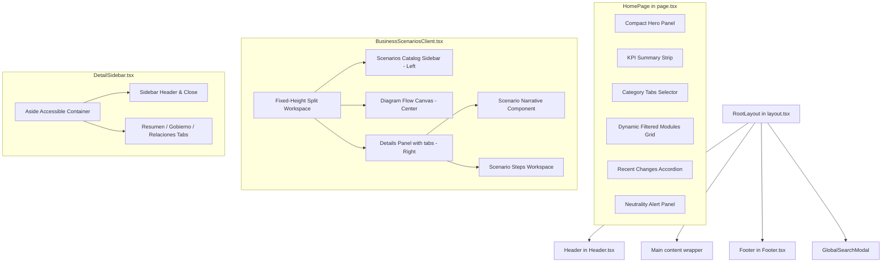

# 03 - Mapa de Componentes (Component Map)

Este mapa de componentes muestra la arquitectura de las interfaces actualizadas:

```mermaid
graph TD
    RootLayout[RootLayout in layout.tsx]
    RootLayout --> Header[Header in Header.tsx]
    RootLayout --> MainContent[Main content wrapper]
    RootLayout --> Footer[Footer in Footer.tsx]
    RootLayout --> GlobalSearchModal[GlobalSearchModal]

    subgraph HomePage [HomePage in page.tsx]
        HeroPanel[Compact Hero Panel]
        KPIStrip[KPI Summary Strip]
        Tablist[Category Tabs Selector]
        ModuleGrid[Dynamic Filtered Modules Grid]
        CollapsibleReleases[Recent Changes Accordion]
        Disclaimer[Neutrality Alert Panel]
    end

    subgraph BusinessScenarios [BusinessScenariosClient.tsx]
        SplitContainer[Fixed-Height Split Workspace]
        SplitContainer --> CatalogSidebar[Scenarios Catalog Sidebar - Left]
        SplitContainer --> DiagramPane[Diagram Flow Canvas - Center]
        SplitContainer --> DetailPane[Details Panel with tabs - Right]
        DetailPane --> NarrativeTab[Scenario Narrative Component]
        DetailPane --> StepsTab[Scenario Steps Workspace]
    end

    subgraph DetailSidebarComponent [DetailSidebar.tsx]
        AsideContainer[Aside Accessible Container]
        AsideContainer --> SidebarHeader[Sidebar Header & Close]
        AsideContainer --> SidebarTabs[Resumen / Gobierno / Relaciones Tabs]
    end
```
